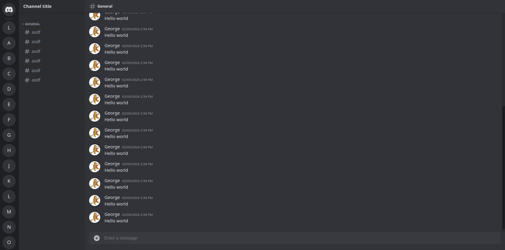

# Discord clone

A clone of Discord made using React and Express.js backend

## Features

- Creating, viewing, updating and deleting features for channels, messages, and servers
- JWT authencation with username/password, Google OAuth, Discord OAuth, and Github OAuth

