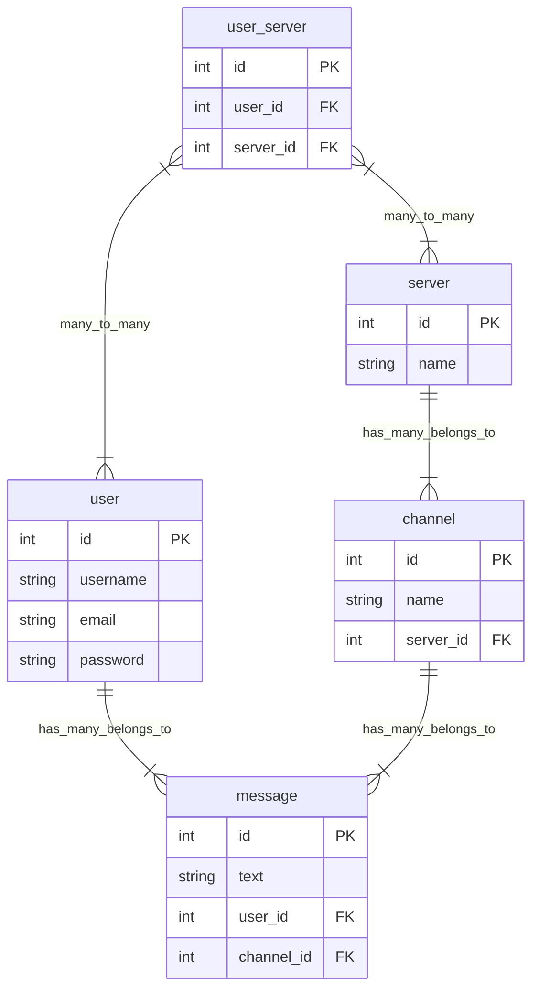

<h1 align="center">Project plan</h1>

### Todo

---

<ul>
    <li>Create frontend UI</li>
    <ul>
        <li>Create sidebar - DONE</li>
        <li>Create input box - DONE</li>
        <li>Create message view - DONE</li>
    </ul>
    <li>Create backend</li>
    <ul>
        <li>Implement messaging feature - DONE</li>
        <li>Fix folder structure - DONE</li>
        <li>Add users/login functionality - DONE</li>
        <li>Add channels - DONE</li>
        <li>Add servers - DONE</li>
        <li>Write tests for code</li>
        <ul>
            <li>Write integration and e2e tests for user signup and login - DONE</li>
            <li>Write integration and e2e tests for server stuff</li>
            <li>Write integration and e2e tests for channel stuff</li>
        </ul>
        <li>fix frontend - DONE</li>
        <li>Get messages to be saved on invidual channels</li>
        <li>Add CRUD API endpoints - DONE</li>
        <ul>
            <li>Add CRUD operations to servers - DONE</li>
            <li>Add CRUD operations to channels - DONE</li>
            <li>Add CRUD operations to messages - DONE</li>
        </ul>
        <li>Get servers, channels, and user to load before showing page</li>
        <li>Fix initial data fetching and bugs</li>
        <li>Add socket operations - DONE</li>
        <ul>
            <li>Add socket operations to servers DONE</li>
            <li>Add socket operations to channels - DONE</li>
            <li>Add socket operations to messages - DONE</li>
        </ul>
        <li>Create a way for users to join a server - DONE</li>
        <li>Add a list of users for the server - DONE</li>
        <li>Reorganize react query code - DONE</li>
        <li>Add authentication to socket connection - DONE</li>
        <li>Add ways to invite people into server - DONE</li>
        <li>Popout that displays user info of the user clicked - DONE</li>
        <li>Automatically create a general channel when a server is created - DONE</li>
        <li>Add friending users - DONE</li>
        <li>Create a user direct message home page</li>
        <li>Add pagination fetching for messages in channels</li>
        <li>Add loading animations</li>
        <li>Add more detail to chat messages display</li>
        <li>Emoji button</li>
        <li>Authorization</li>
        <li>add socket stuff to have a live view of which users are online or not in users list</li>
        <ul>
            <li>Add authorization to servers</li>
            <li>Add authorization to channels</li>
            <li>Add authorization to messages</li>
        </ul>
        <li>Voice/video call stuff</li>
    </ul>
</ul>

### Database layout

---

### Known Bugs:

### Frontend:

<ul>
    <li>Inefficient data fetching - FIXED</li>
    <li>Clicking on server sends you to empty channel page - FIXED</li>
</ul>

should have used github projects kanban board instead of this :/
