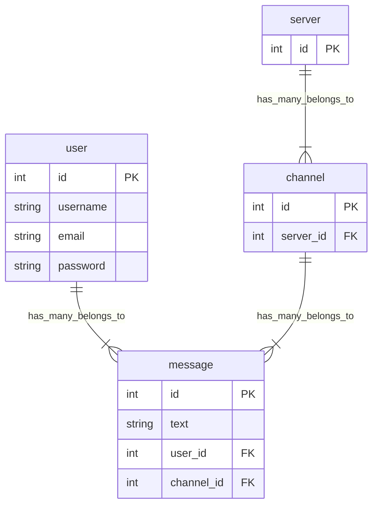

<h1 align="center">Project plan</h1>

### Todo

---

<ul>
  <li>Create frontend UI</li>
  <ul>
    <li>Create sidebar - DONE</li>
    <li>Create input box - DONE</li>
    <li>Create message view - DONE</li>
  </ul>
  <li>Create backend</li>
  <ul>
    <li>Implement messaging feature - DONE</li>
    <li>Fix folder structure</li>
    <li>Write tests for code</li>
    <li>Add users/login functionality</li>
    <li>Add channels</li>
    <li>Add servers</li>
  </ul>
</ul>

### Database layout

---

