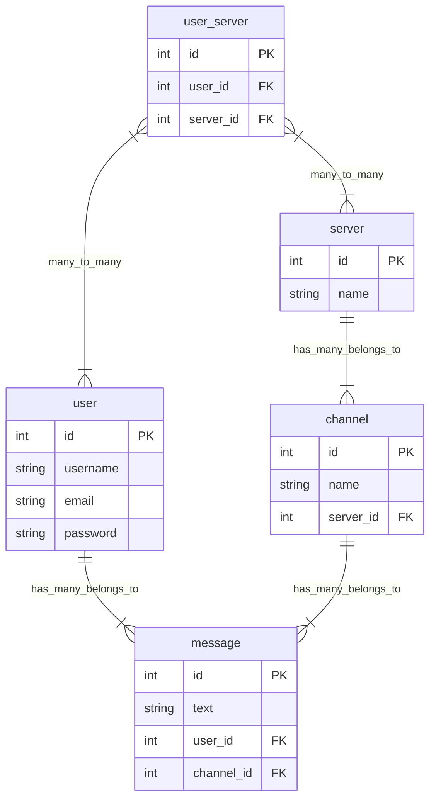

<h1 align="center">Project plan</h1>

### Todo

---

<ul>
    <li>Create frontend UI</li>
    <ul>
        <li>Create sidebar - DONE</li>
        <li>Create input box - DONE</li>
        <li>Create message view - DONE</li>
    </ul>
    <li>Create backend</li>
    <ul>
        <li>Implement messaging feature - DONE</li>
        <li>Fix folder structure - DONE</li>
        <li>Add users/login functionality - DONE</li>
        <li>Add channels - DONE</li>
        <li>Add servers - DONE</li>
        <li>Write tests for code</li>
        <ul>
            <li>Write integration and e2e tests for user signup and login - DONE</li>
            <li>Write integration and e2e tests for server stuff</li>
            <li>Write integration and e2e tests for channel stuff</li>
        </ul>
        <li>fix frontend - DONE</li>
        <li>Get messages to be saved on invidual channels</li>
        <li>Add CRUD API endpoints</li>
        <ul>
            <li>Add CRUD operations to servers</li>
            <li>Add CRUD operations to channels</li>
            <li>Add CRUD operations to messages</li>
        </ul>
        <li>Add socket operations</li>
        <ul>
            <li>Add socket operations to servers</li>
            <li>Add socket operations to channels</li>
            <li>Add socket operations to messages</li>
        </ul>
        <li>Add authentication to socket connection</li>
        <li>Get servers, channels, and user to load before showing page</li>
        <li>Create a user direct message home page</li>
        <li>Add react query to cache responses</li>
        <li>Add ways to invite people into server</li>
        <li>Add pagination fetching for messages in channels</li>
        <li>Add loading animations</li>
    </ul>
</ul>

### Database layout

---

