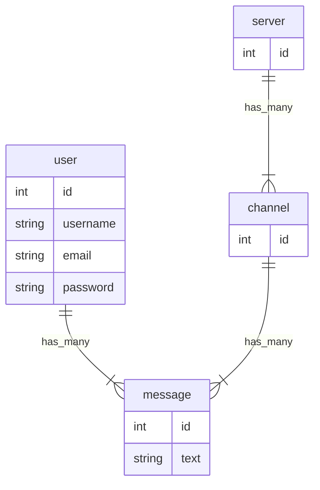

### Todo

<ul>
  <li>Create frontend</li>
  <ul>
    <li>Create sidebar</li>
    <li>Create input box</li>
    <li>Create message view</li>
  </ul>
  <li>Create backend</li>
  <ul>
    <li>Implement messaging feature</li>
    <li>Add users/login functionality</li>
  </ul>
</ul>

### Database layout

